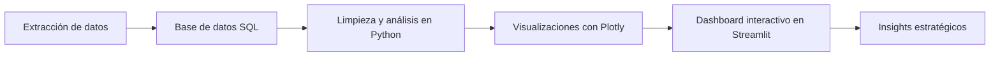

# 💄 Sephora Analytics Dashboard

## 📸 Demo


🔗 **Demo en vivo:** [https://tu-usuario.github.io/sephora-dashboard](https://tu-usuario.github.io/sephora-dashboard)

---

## 📋 Tabla de contenidos

- [Descripción](#-descripción)
- [Características](#-características)
- [Tecnologías](#-tecnologías)
- [Instalación](#-instalación)
- [Uso](#-uso)
- [Estructura](#-estructura-del-proyecto)
- [Flujo de la aplicación](#-flujo-de-la-aplicación)
- [Lo que aprendí](#-lo-que-aprendí)
- [Mejoras futuras](#-mejoras-futuras)
- [Autor](#-autor)

---

## 📖 Descripción

Este proyecto consiste en un dashboard analítico e interactivo desarrollado con Python, SQL y Streamlit para analizar el comportamiento del catálogo y las reviews de Sephora.

El objetivo principal fue transformar grandes volúmenes de datos en insights visuales y estratégicos, permitiendo analizar patrones de consumo, engagement, satisfacción y tendencias de comportamiento de los usuarios.

El sistema integra análisis exploratorio, visualización interactiva y segmentación de consumidores dentro de un único entorno analítico orientado a negocio.

---

## ✨ Características

- ✅ Dashboard interactivo desarrollado en Streamlit
- ✅ Integración de base de datos SQL relacional
- ✅ Análisis de productos y reviews de Sephora
- ✅ Visualizaciones dinámicas con Plotly
- ✅ Filtros interactivos por categorías y precios
- ✅ Segmentación de perfiles de consumidores
- ✅ Análisis de salud de marca y sentimiento
- ✅ Simulador de impacto financiero
- ✅ Análisis temporal de reviews
- ✅ Diseño responsive e interactivo

---

## 🛠️ Tecnologías

| Tecnología | Para qué |
|------------|----------|
| Python | Procesamiento y análisis de datos |
| Pandas | Limpieza y manipulación de datos |
| SQL / TiDB | Base de datos relacional |
| Streamlit | Desarrollo del dashboard interactivo |
| Plotly | Visualizaciones dinámicas |
| Git & GitHub | Control de versiones |
| Jupyter Notebook | Análisis exploratorio |

---

## ⚙️ Instalación

```bash
# 1. Clonar el repositorio
git clone https://github.com/nicol-ael/sephora-dashboard.git

# 2. Entrar en la carpeta
cd sephora-dashboard

# 3. Crear entorno virtual
python -m venv venv

# 4. Activar entorno virtual

# Windows
venv\Scripts\activate

# Mac/Linux
source venv/bin/activate

# 5. Instalar dependencias
pip install -r requirements.txt

# 6. Ejecutar Streamlit
streamlit run app.py

## 💡 Uso

1. Ejecuta la aplicación con Streamlit.
2. Explora las métricas generales del catálogo.
3. Utiliza el panel lateral para filtrar datos por:
   - Categorías
   - Rangos de precio
   - Nivel de interacción
4. Analiza visualizaciones de:
   - Relación entre precio y ratings
   - Concentración de engagement
   - Evolución temporal de reviews
5. Explora perfiles de consumidores según:
   - Tipo de piel
   - Tono de piel
   - Color de ojos
6. Consulta insights de salud de marca y análisis de sentimiento.

---

## 📁 Estructura del proyecto

```bash
sephora-dashboard/
├── app.py
├── pages/
│   ├── consumer_profiles.py
│   ├── brand_health.py
│   └── main_dashboard.py
├── notebooks/
│   └── eda_sephora.ipynb
├── database/
│   └── schema.sql
├── assets/
│   └── image.jpg
├── requirements.txt
└── README.md
```

---

## 🔄 Flujo de la aplicación



---

## 📊 Principales análisis realizados

### 💰 Relación entre Precio y Calificaciones

Se analizó la relación entre el precio de los productos y las calificaciones otorgadas por los usuarios.

Los resultados muestran que el precio tiene una influencia limitada sobre la satisfacción general del consumidor, ya que productos con distintos rangos de precio mantienen valoraciones similares.

---

### 📈 Concentración de Engagement

El análisis evidenció una distribución desigual del engagement, donde un pequeño grupo de productos concentra gran parte de las interacciones y reviews dentro del catálogo.

---

### ⏳ Evolución Temporal de Reviews

Se identificó un crecimiento progresivo de actividad a partir de 2017 y un incremento acelerado después de 2018, mostrando una mayor participación de usuarios dentro de la plataforma.

---

## 👥 Módulos del Dashboard

### 🏠 Página Principal

- Métricas generales del ecosistema
- Tasa de recomendación
- Filtros dinámicos
- Simulador financiero
- Análisis de engagement y reviews

### 👤 Perfiles de Consumidor

Segmentación de usuarios utilizando variables como:

- Tipo de piel
- Tono de piel
- Color de ojos
- Preferencias de consumo

Además, el sistema genera insights automáticos sobre:
- Producto más reseñado
- Gasto promedio
- Nivel de satisfacción
- Marcas preferidas

### 💬 Salud de Marca

Análisis basado en más de 926 mil reviews para evaluar:

- Satisfacción del consumidor
- Distribución de ratings
- Índice de helpfulness
- Explorador temático de palabras clave
- Comparación de productos altamente recomendados vs. baja aceptación

---

## 🎓 Lo que aprendí

- Integración de SQL, Python y Streamlit en un mismo flujo de trabajo
- Creación de dashboards analíticos interactivos
- Modelado de bases de datos relacionales
- Desarrollo de visualizaciones estratégicas orientadas a negocio
- Limpieza y análisis exploratorio de grandes volúmenes de datos
- Resolución de problemas técnicos relacionados con Streamlit y SQL

---

## 🚧 Mejoras futuras

- [ ] Implementar autenticación de usuarios
- [ ] Conectar APIs externas de productos
- [ ] Incorporar modelos de Machine Learning
- [ ] Añadir análisis predictivo de tendencias
- [ ] Optimizar rendimiento del dashboard
- [ ] Implementar exportación de reportes PDF
- [ ] Desplegar en la nube con Docker

---

## 👤 Autor

**Nicol Alejandra Escobar Lamprea**

- 🐙 GitHub: [@nicol-ael](https://github.com/nicol-ael)
- 💼 LinkedIn: [Nicol Escobar](https://www.linkedin.com/in/nicolescobardatayhealthcare/)
- ✉️ Email: nicolescobar3330@gmail.com

---

## ⭐ Conclusión

Este proyecto demuestra cómo transformar grandes volúmenes de datos en una plataforma de inteligencia de negocio interactiva, combinando análisis, visualización y segmentación de consumidores dentro de un único ecosistema analítico.